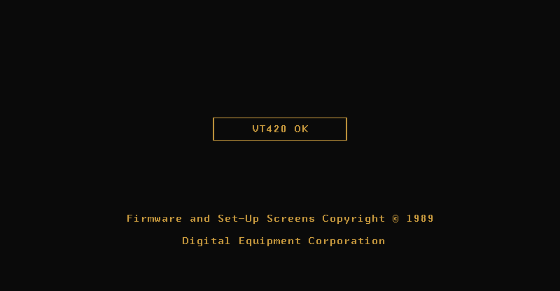
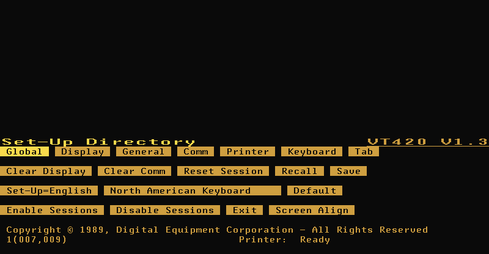
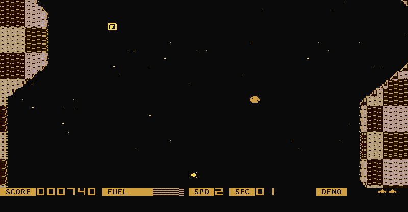

# Ezalb: a VT420 terminal emulator

Ezalb emulates the real VT420 hardware and runs the original DEC firmware ROM:
8051 CPU, DC7166 video processor, SCN2681 DUART, ER5911 NVR EEPROM and the
LK201/LK401 keyboard. Plain C11, single binary, SDL2 for the graphical display.
No frameworks, no build system beyond make.

Ezalb is a rewrite of [blaze](https://github.com/mmastrac/blaze) in plain C.

## Screenshots

Power-on self-test finishing in the factory ROM:



Set-Up Directory (F3) — the firmware's own menus, not a reimplementation:



[VT Raid](https://github.com/tenox7/vtraid) attract mode on comm1, drawn with
DRCS soft fonts and the hardware scroll region, recorded with the MCP `video`
tool:



## Features

- Full VT420 hardware emulation: boots the factory ROM through self-test into
  the real firmware, including Set-Up, dual sessions, 80/132 columns, smooth
  scrolling, double width/height, blink, custom soft fonts
- LK201/LK401 keyboard protocol
- Two serial sessions (DUART channels A/B) connectable to a shell on a PTY,
  a pipe/FIFO, loopback, or a real serial port
- Real serial ports: `--comm1 'serial /dev/cu.usbserial-1410'` talks to actual
  hardware, and changing the speed or format in Set-Up retunes the port
- NVR (EEPROM) persistence to a file — Set-Up changes survive restarts
- Three display modes: SDL2 window, ANSI TUI in your terminal, headless
- Screen recording to animated GIF: `--record FILE.gif` in graphics mode, or
  the MCP `video` tool
- MCP server mode: AI agents (Claude Code) can run the terminal, type on the
  LK201, take screenshots and record video
- VT510 / VT520 / VT525 ROMs boot headless (machine support is skeletal)

## Build

Requires a C compiler, SDL2, zlib and pkg-config
(`brew install sdl2` / `apt install libsdl2-dev zlib1g-dev pkg-config`).

```
make            # builds ./ezalb
make test       # ROM boot test (boots to "VT420 OK", enters Set-Up) + comm session tests
make mcp_test   # MCP smoke test: boots, types into a shell, screenshots
```

## Packages

```
make app        # macOS Ezalb.app (bundles SDL, double-click = shell)
make dmg        # build/Ezalb.dmg
make release    # signed + notarized dmg (DEV_ID/NOTARY_PROFILE in .env)
make deb rpm    # Linux packages via docker, output in dist/
                # cross-arch: deb-amd64 deb-arm64 rpm-amd64 rpm-arm64
```

Launched with no arguments (bare `ezalb`, Finder, .desktop) it boots straight
into a login shell on comm1 in graphics mode, with NVR in `~/.vt420.nvr`.

## Quick start

```
# Login shell in a VT420 window
./ezalb

# Graphical display, shell on comm1
./ezalb --display graphics --comm1 'exec /bin/sh'

# ANSI TUI in your terminal
./ezalb --display text --comm1 'exec /bin/sh'

# Record the session to an animated GIF
./ezalb --display graphics --comm1 'exec /bin/sh' \
    --record demo.gif

# Talk to a real serial port, minicom style
./ezalb --display graphics \
    --comm1 'serial /dev/cu.usbserial-1410'

# Persist Set-Up settings
./ezalb --display graphics --nvr ~/.vt420.nvr

# Benchmark the CPU core
./ezalb --benchmark
```

Boot runs a couple of seconds of firmware self-test; `--skip-diagnostics`
fast-forwards it.

## Usage

```
--rom NAME|FILE       built-in ROM (default: per --machine) or ROM file
--list-roms           list the built-in ROMs
--nvr FILE            NVR EEPROM file (created if missing)
--display MODE        headless (default) | text | graphics
--comm1 / --comm2 CFG serial session: loopback | pipe PATH | serial PATH |
                      exec CMD [--no-pty] [--rows N] [--cols N]
--record FILE         record the display to an animated GIF (graphics mode)
--machine TYPE        vt420 (default) | vt52x | vt510
--mcp                 run as an MCP server on stdio (see below)
--benchmark           run 100M instructions and report speed
--skip-diagnostics    fast-forward power-on self-test
--log                 log to $TMPDIR/ezalb-vt.log (text mode)
--show-mapper / --show-vram   debug overlays (text mode)
-v                    verbose logging
```

Keys: F1–F20 map to the LK201 (F3 = Set-Up, F4 = switch session), arrows,
Home/End/PgUp/PgDn = Find/Select/Prev/Next Screen, Backspace = Delete.
Text mode is commanded via Ctrl+G: `q` quit, space pause, `1`–`5` = F1–F5,
`h` hex view, `d` dump VRAM to /tmp/vram.bin.

## Serial ports

`serial PATH` wires a session to a real serial port — `/dev/cu.*` on macOS,
`/dev/ttyUSB*` or `/dev/ttyS*` on Linux, `/dev/cuaU*` on the BSDs.

```
./ezalb --display graphics \
    --comm1 'serial /dev/cu.usbserial-1410'
```

The port is opened raw, and its speed and format come from Set-Up → Comm:
whatever the firmware programs into the DUART is applied to the real port, so
change the speed on the terminal, not on the command line. 38400 is the
maximum, the SCN2681's own ceiling.

## MCP server — drive the VT420 from Claude Code

`ezalb --mcp` runs the machine headless behind an
[MCP](https://modelcontextprotocol.io) server on stdio, so an AI agent can use
the terminal like a person at the console: run full-screen applications on the
serial ports, type on the LK201, watch the screen. This repo ships a
`.mcp.json` that starts it with a shell on comm1; for your own project:

```
claude mcp add vt420 -- /path/to/ezalb --mcp --skip-diagnostics \
    --nvr ~/.vt420.nvr --comm1 'exec /bin/sh'
```

Tools: `read_screen` (text, with optional attribute annotations),
`screenshot` (pixel-exact 800x416 PNG), `video` (animated GIF of N
emulated ms written to a file), `type` / `key` (LK201 input, paced
like human typing — the firmware drops faster keystrokes), `wait`
(expect-style: block until text appears on screen), `record` (frame series:
blink, smooth scroll), `session` (swap comm1/comm2 to a new `exec ...` at
runtime), `reset` (power-cycle), `pace` (speed / deterministic pause),
`status`.

The machine free-runs at 10x real time; waits and `video` durations are in
emulated ms, so use `pace {speed:1}` when recording a program's output.
Serial-line realities apply: after `reset` or `session`, `wait` for the
program's prompt before typing, or the pty will flush your input.

## ROMs

The firmware images (VT420 V1.3/V1.4/B1.4, VT510, VT520, VT525) are gzipped
into the binary at build time, so no ROM file is needed — `--list-roms` shows
the names, `--rom` also takes a path to an external image. The originals are in
`roms/`, with hardware documentation in `architecture/` and `datasheets/`.

## License

AGPL-3.0, inherited from the original project. Firmware ROMs are copyright
Digital Equipment Corporation.
